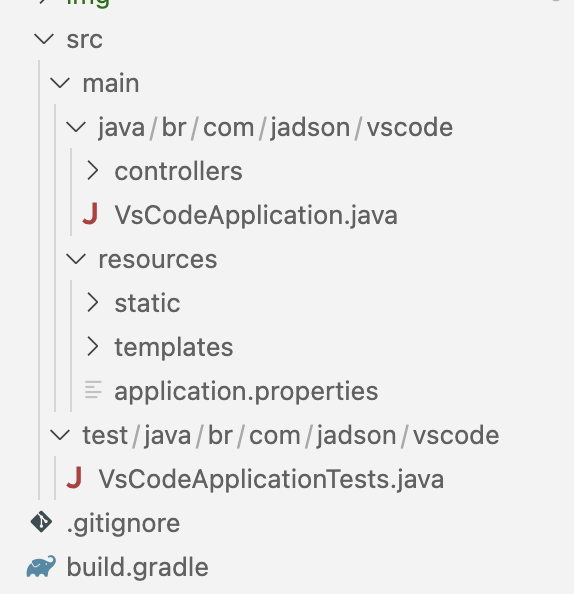

# Using VSCode for Java projects

## VSCode

Visual Studio Code is a source code editor developed by Microsoft for Windows, Linux and macOS. It is a free, lightweight and powerful source code editor that runs on your desktop and on the web. It is also highly customizable, with hundreds of existing extensions to use. It has extensions for several program languages like JavaScript, TypeScript, C++, C#, Java, Python and Dockerfile.

### VSCode Installation

You can access https://code.visualstudio.com/download and download the respective package for you Operation System.

  

### VSCode Extensions

Extension Pack for Java is a collection of popular extensions that can help write, test and debug Java applications in Visual Studio Code. It is composed of six extensions:

1) Language Support for Java™ by Red Hat
2) Debugger for Java
3) Test Runner for Java
4) Maven for Java
5) Project Manager for Java
6) Visual Studio IntelliCode

Spring Initializr is a lightweight extension to quickly generate a Spring Boot project in Visual Studio Code (VS Code). It helps you to customize your projects with configurations and manage Spring Boot dependencies.

This extension provides a visual interface for your Gradle build. You can use this interface to view Gradle Tasks and Project dependencies, or run Gradle Tasks as VS Code Task.

Install these extensions and restart the Vscode.

   

## Spring Boot

Spring Boot is a framework that cames to reduce the significant time and knowledge to configure, set up, and deploy Spring applications.

Spring is one of the most popular open source framework for the Java platform created by Rod Johnson and described in his book "Expert One-on-One: JEE Design and Development". It is a non-intrusive framework, based on inversion of control and dependency injection design patterns.

   

## Spring Boot project

### Creating a new Spring Boot project

You can type: ``ctrl + sift + p`` and should **"Spring Initializr: Create a Gradle Project..."**

And then, choose all spring boot parameters like you was is the https://start.spring.io site.

Choose the spring boot version:

Choose the spring boot language:

Choose the spring boot dependences:

 

### Open the  Spring Boot project in VSCode

This will create and configure a a new spring boot project in the VSCode

To run or debug the spring boot project, you can spring boot main class and click in "Run|Debug"

Or use the button in the VSCode interface.

We now create a spring boot controller:

#### Environments Variables

In some cases, it is necessary to use Environments Variables to project sensitive data, like database user and password.

In the VsCode, we configure this information in a **launch.json** file under **.vscode** directory.  To create a launch.json file, click the "create a launch.json file" link in the Run start view.

In the launch file, add the enviroments variables values. Do not commit this file, add it to **.gitignore** file.

### 986MB VsCode  vs 2,47GB Intellij 

The main advatage of VsCode is its lightweight compared with other Java IDEs.

VS

